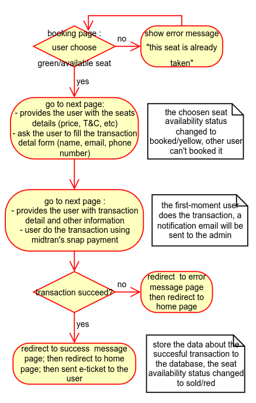

## About This Project
This repository is used to developing the ticketing website for Gadjah Mada Chamber Orchestra. 

## Ticketing Flow Diagram

## How to Run This Project
<ol>
    <li>copy the .env.example to .env</li>
    <li>customize your .env file and the dokcer compose file. Hint: follow the instructions within those files, the necessary changes will be highlighted with <code>#change me</code> comment</li>
    <li>build the dokcer image and run the container using  <code>docker compose up --build</code></li>
    <li>make sure all the container are active with <code>docker container ls --all</code></li>
    <li>go to the application container (the default is <code>gmco-app</code>)</li> using this command <code>dokcer exec -it gmco-app bash</code> Hint: the name of the container may be change due to the modification you made on the step 2
    <li>inside the application container, run this command to migrate the database <code>php artisan migrate:fresh --seed</code></li>
    <li>dont forget to start the laravel queue using <code>php artisan queue:work</code> to enable the email functionality</li>
    <li>test the application on <code>http://localhost:80</code> (this is the default url) and feel free to contact me if you encounter some bugs or error</li>    
</ol>

## Midtrans Integration
This app use midtran's snap as payment gateway for detail documentation and sequence diagram please refer to <a>docs.midtrans.com/en/snap/integration-guide</a>. Note: this web use the Snap Popup Mode

## Endpoints
for detail information about all available endpoint please check the [web.php](./routes/web.php) file and the [api.php](./routes/api.php) file 

